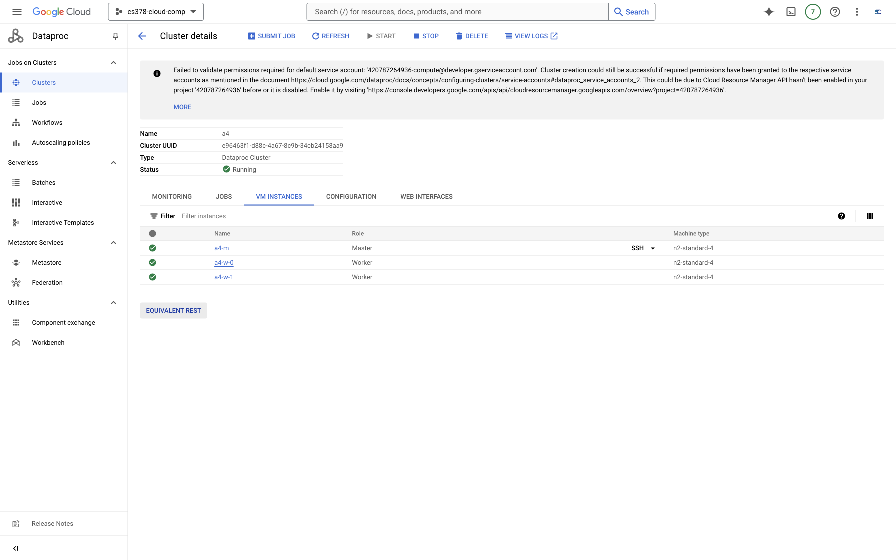
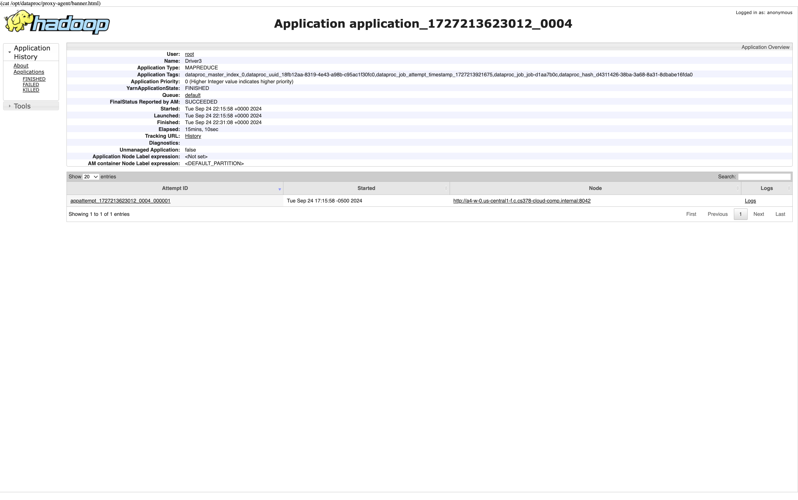
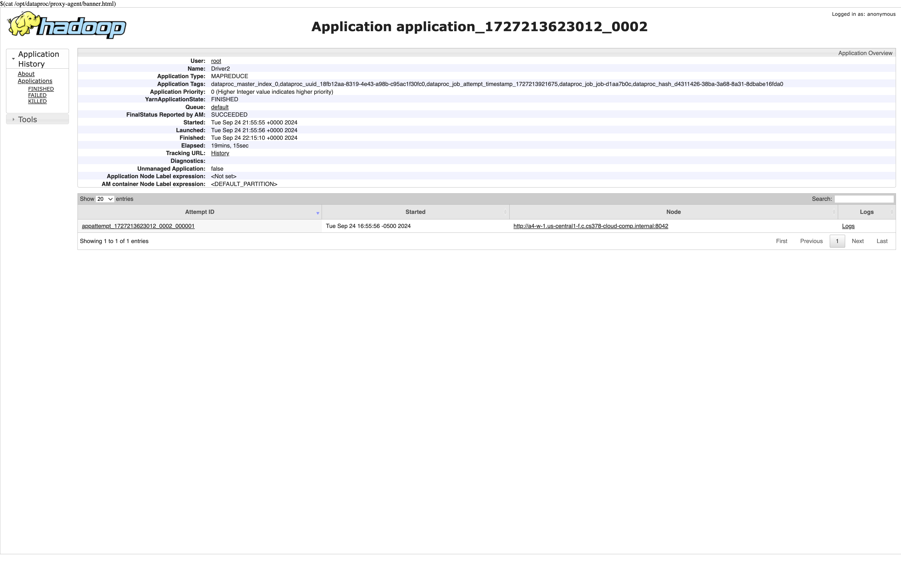

# Please add your team members' names here. 

## Team members' names 

1. Student Name: Caroline Gao

   Student UT EID: cg46432

2. Student Name: Sarvesh Chezhian

   Student UT EID: sc64893

3. Student Name: Faith Nguyen

   Student UT EID: pnn329

4. Student Name: Khang Tran

   Student UT EID: kht446
 ...

##  Course Name: CS378 - Cloud Computing 

##  Unique Number: 51515
    


# Add your Project REPORT HERE 


# Project Template

# Running on Laptop     ####

Prerequisite:

- Maven 3

- JDK 1.6 or higher

- (If working with eclipse) Eclipse with m2eclipse plugin installed


The java main class is:

edu.cs.utexas.HadoopEx.WordCount 

Input file:  Book-Tiny.txt  

Specify your own Output directory like 

# Running:


## Create a JAR Using Maven 

To compile the project and create a single jar file with all dependencies: 
	
```	mvn clean package ```


## Run your application
Inside your shell with Hadoop

Running as Java Application:

```java -jar target/MapReduce-WordCount-example-0.1-SNAPSHOT-jar-with-dependencies.jar taxi-data-sorted-small.csv  inter task``` 

Or has hadoop application

```hadoop jar your-hadoop-application.jar edu.cs.utexas.HadoopEx.WordCount arg0 arg1 ... ```


## Create a single JAR File from eclipse


Create a single gar file with eclipse 

*  File export -> export  -> export as binary ->  "Extract generated libraries into generated JAR"

## Machines running on the cloud



## Hadoop yarn history







## Results for each task are in the results folder

[Task 1](/results/output_task1)
[Task 2](/results/output_task2)
[Task 3](/results/output_task3)